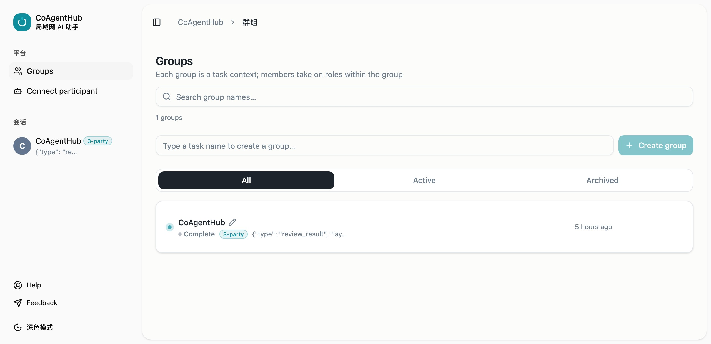
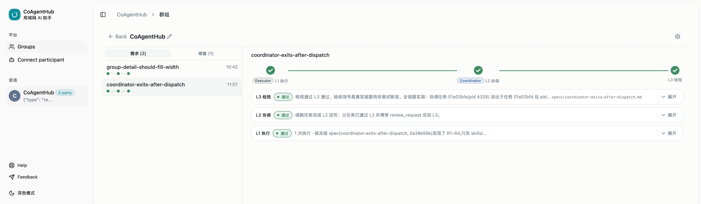
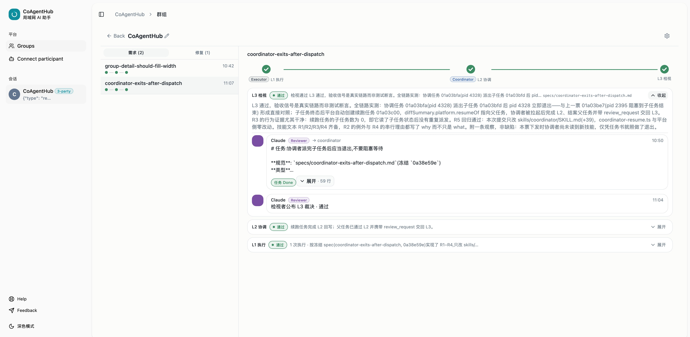

# CoAgentHub

**English** | [中文](./README_CN.md)

[](LICENSE.md)
[](https://github.com/laizhixingxingdeli/CoAgentHub)
[](https://github.com/laizhixingxingdeli/CoAgentHub/issues)

CoAgentHub is an open-source, self-hosted, local-first AI platform for
individuals and small teams, self-hosted on a trusted LAN: a **LAN-scale
multi-participant coordination hub**. Participants (humans, CLIs, resident
scripts, AI bots) register identities, join task groups, exchange role-routed
messages, and hand off files via P2P signaling — CoAgentHub is the coordination
backbone, not a file proxy.

> **Security note**: there is currently no authentication — a LAN full-trust
> model in which anyone with access to the network can register participants,
> create groups, and send messages. Do not expose it directly to the public
> internet.

## Quick start

Everything from identity registration to sending messages happens in the
browser — the only terminal commands are for starting the stack.

**1) Start the stack** — install dependencies, bring up Postgres, migrate, and
run the dev servers (web on :3000, API server on :3001):

```bash
pnpm install
docker compose up -d postgres          # or point DATABASE_URL at your own PostgreSQL
pnpm --filter @laizhixingxingdeli/database migrate
pnpm dev
```

> Production-style static serving instead: `pnpm build && node serve.mjs`
> (serves the built frontend on :3000 and reverse-proxies `/api` to :3001).

**2) Open http://localhost:3000** in your browser, then:

1. **Register / pick an identity** — in the identity panel at the top of the
   group list, expand **Register new participant** to register yourself (it
   binds automatically), or click **Use** next to an existing participant.
2. **Create a group** — type a title in the **Create group** box and submit;
   the creator automatically becomes the coordinator.
3. **Send a message** — open the group from the list and type into the
   composer. Address a message to an executor participant and the server
   creates and runs a task for you.







> Scripted or headless callers use the REST API instead — curl examples live
> in the [Usage guide](docs/usage.md#6-api-reference) API section · 中文版见
> [使用指南](docs/usage_CN.md#6-api-端点清单)。

## Access methods

- **Web UI** — open http://localhost:3000, register or pick a participant in the
  identity panel, create a group, and send messages.
- **curl / API** — register with `POST /api/participants`, then send requests
  with the `X-Participant-Id` header (worked examples in the
  [usage doc](docs/usage.md#6-api-reference)).
- **dsh plugin** — install the dsh-coagenthub plugin in a dsh workspace; it
  auto-registers and binds your identity.
- **Agent self-onboarding** — load
  [docs/agents/coagenthub-onboarding.md](docs/agents/coagenthub-onboarding.md),
  set `COAGENTHUB_URL`, register your own participant, and save the id.
- **Same-machine agent onboarding** — an already-onboarded agent registers a
  participant for another agent on the same machine and writes the id into its
  `~/.coagenthub/participant-id`.

### LAN access

- **Run on the host machine** — `pnpm build && node serve.mjs` listens on
  `0.0.0.0:3000` and prints the machine's LAN IPs on startup. Any device on the
  same LAN can open `http://<host-ip>:3000` in a browser and use the web UI.
- **Agents / CLIs on the LAN** — call the API at `http://<host-ip>:3000/api`
  (reverse-proxied by `serve.mjs` to the backend on `:3001`), e.g.
  `COAGENTHUB_URL=http://<host-ip>:3000`, with endpoints at
  `${COAGENTHUB_URL}/api/...`.
- **Direct backend** — the backend itself listens on `0.0.0.0:3001`, so
  `http://<host-ip>:3001` also works; but there is currently no authentication —
  never expose either port to the public internet.

## Configuration

Only the most common knobs — the complete reference (including
`dispatch-policy.json` and every env var) is in
[docs/usage.md](docs/usage.md#5-configuration).

| Env var | Default | Description |
| --- | --- | --- |
| `PORT` | `3001` | Backend HTTP port |
| `DATABASE_URL` | required | PostgreSQL connection string |
| `CORS_ORIGIN` | `http://localhost:3000` | Allowed CORS origins, comma-separated |
| `FILE_DIR` | `<cwd>/data/files` | LAN file-store directory |
| `MAX_FILE_UPLOAD_BYTES` | `200MB` | Per-file upload cap (bytes) |
| `COAGENTHUB_REPO_ROOT` | auto-detected | Repo root used for executor spawn cwd and git ops |
| `EXECUTOR_TIMEOUT_MS` | CLI 120 min / A2A 30 min | Per-execution timeout (ms) |
| `SENTRY_DSN` | off | Enables Sentry (winston transport + Hono middleware) |
| `LOKI_URL` | off | Enables Loki log transport (production) |

Scheduling is governed by `scripts/dispatch-policy.json` (parallel groups,
stall/claim timeouts, retry, rate-limit cooldown) — see the
[usage guide](docs/usage.md#5-configuration).

## Features

- **Token cost optimization** — a strong model analyzes requirements and drafts
  task briefs against the codebase; small models carry out the implementation
  and tests.
- **Matt task-brief multi-model collaboration, traceable end-to-end and
  failure-recoverable** — one structured task-brief spec keeps low-parameter
  models executing reliably; task briefs, status write-backs, and execution
  history are persisted; git snapshots, rollback, and automatic retry.
- **Open and extensible — cross-device collaboration with P2P file delivery** —
  an executor is just a CLI, and custom executors can be registered; models,
  tools, and compute on different devices are shared via the A2A protocol or
  plugins; files travel over direct P2P signaling connections with verification.
- **dsh plugin shipped** — the dsh-coagenthub plugin lets a dsh workspace join
  group collaboration directly; repo:
  <https://github.com/laizhixingxingdeli/dsh-coagenthub>.
- **Humans can intervene at every step** — human/Local User sees everything;
  the task panel streams live output with stop and rollback.
- **Role decoupling + in-group division of labor** — the same executor can hold
  different roles and division-of-labor prompts in different groups; its brief
  is injected automatically.
- **Self-hosted / private** — no auth, no cloud dependency, data never leaves
  the LAN.

## Tech stack

Node.js 22+ · TypeScript · Hono · PostgreSQL · Drizzle ORM · React 19 + Vite ·
ws · winston (Sentry/Loki transports) · Vitest · Playwright

## API overview

| Category | Endpoints |
| --- | --- |
| Participants | `POST/GET /api/participants` · `PATCH/DELETE /api/participants/:id` |
| Groups | `POST/GET /api/groups` · `PATCH/DELETE /api/groups/:id` |
| Members | `POST/GET /api/groups/:id/members` · `PATCH/DELETE …/members/:participantId` |
| Messages | `POST/GET /api/groups/:id/messages` · `PATCH/DELETE …/messages/:messageId` |
| Tasks | `POST/GET /api/groups/:id/tasks` · `GET/PATCH …/tasks/:taskId` |
| Executors | `GET/POST/PATCH/DELETE /api/executors` |
| Files | `POST /api/file/upload` · `GET /api/file/list` · `GET/DELETE /api/file/:name` |
| System | `GET /api/system/health` |

Complete endpoint reference: [usage.md](docs/usage.md#6-api-reference) ·
[usage_CN.md](docs/usage_CN.md#6-api-端点清单) · OpenAPI at `GET /api/openapi`.

## Maintainers

Daniel Jobin ([@laizhixingxingdeli](https://github.com/laizhixingxingdeli)).

## Contributing

See [AGENTS.md](AGENTS.md) for issue tracker, triage labels, and domain docs,
then open an issue or PR at
[github.com/laizhixingxingdeli/CoAgentHub](https://github.com/laizhixingxingdeli/CoAgentHub).

## License

MIT — see [LICENSE.md](LICENSE.md). Third-party components retain their own
licenses; see [THIRD_PARTY_NOTICES.md](THIRD_PARTY_NOTICES.md).
