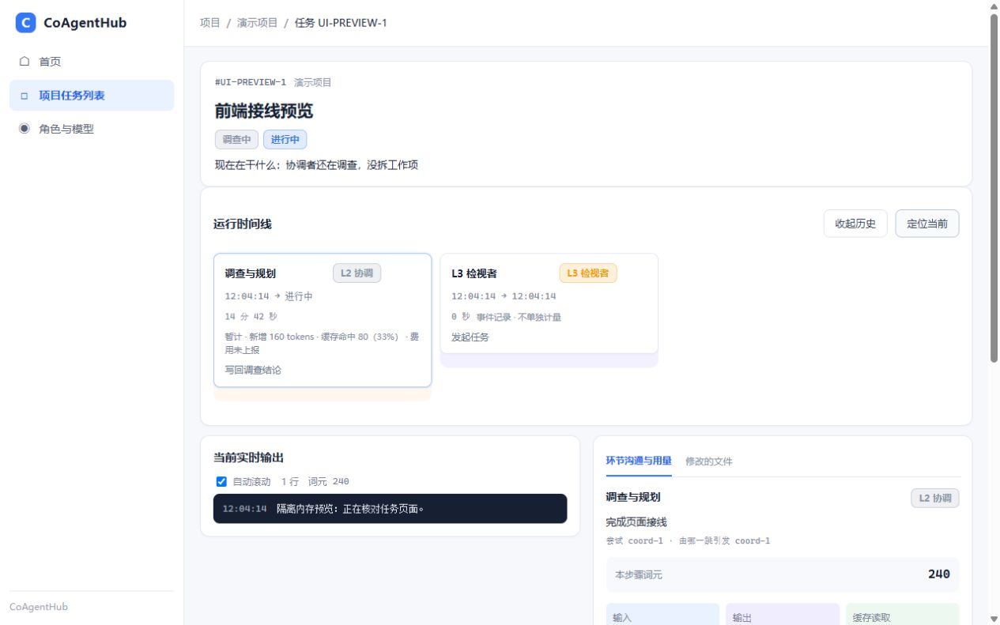

# 前端接线交付（2026-10-04）

## 范围
基线 auto/harness-remaining ffbf5af；实现分支 codex/frontend-implementation，独立 worktree frontend-implementation。依据用户连续确认的设计及「接入」「继续完成」直接实施，不生成平台 Mission、L2 交卷或 L3 签名。master 未操作。设计原型与设计记录保留在独立 codex/frontend-design（65cdf40），未将模拟数据混入正式代码。

## 已接入
- 首页：现有平台状态和候选健康接口，进行中任务入口。
- 项目任务列表：真实 projects/missions 接口，选择项目、全部任务状态、最近活动倒序，不设最近完成分栏。
- 任务详情：一条运行时间线，开始/结束/进行中时间、持续更新耗时、定位当前和收起历史；URL 保存选中环节，包括无 attemptId 的 L3 事件组。
- 当前实时输出：独立区域与游标轮询，切历史环节不改变输出；自动滚动、隐藏暂停、离页隔离继续有效。
- 环节沟通与用量：工作单、规划、验收、升级、最终检视、所选尝试证据与历史输出；输入、输出、缓存读取、缓存写入、总词元、费用。结束值与暂计值分开，未知质量或缺字段不当零。
- 角色与模型：四角色，候选上移/下移、启停、移除和保存；真实 revision CAS，保留 facts/endpoint/enabled，冲突保留草稿并要求读取与比较最新版，离页提醒。
- 布局：中文主导航三个入口，完整契约与累计用量折叠展示；800×600 不产生整页横向溢出。

## 验证
定向界面测试 190 项通过；导航兼容专项 85 项通过；末轮任务/刷新/工作台测试 78 项通过。最终全量 `node --test --test-timeout=300000`：2365 项，2358 通过、0 失败、仅 HAOFF1 既有 7 skip；最终任务/刷新/工作台 78 项复跑也通过。日志：`<用户目录>/AppData/Local/Temp/frontend-full-final-20261004.log`。真实 HTTP 版本冲突测试使用 buildPlatform 内存实例，验证候选次序、停用项与事实保留、旧 revision 返回 409。浏览器通过正式 createApi 静态服务与独立内存数据验证项目切换、模型排序保存、当前定位、历史选择与刷新恢复、输出独立性；控制台 error 为空。截图是隔离演示数据，不能作为真实 Mission 已运行或投递成功的证据。

## 数据边界
MissionView 的规划、工单、技术验收为当前投影，界面明确当前版本/当前记录。后端未保留每次流转的全部不可变正文，不能复原完整历史对话；历史执行尝试不借用其他尝试最新交付正文，只显示本尝试证据与输出，缺失如实说明。改动展示已有 diff/stat，不承诺逐行 patch。列表按 updatedAt 排序，不宣称创建时间排序；首页进行中计数不等于正在占用进程的 agent 数量。投递汇总无权威接口，显示未提供。

## 上线边界
新版 coagenthub-codex 0.2.1 list_missions 查询返回 fetch failed，本机 3101 无监听；没有绕插件读取状态文件或启动真实平台。实现代码在独立分支提交，主工作区仍 ffbf5af；平台快照恢复后才能核对暂停/运行状态，再决定集成与安全加载。鉴权 D1d、预算 B7 和其他明确暂缓事项保持暂缓；模型配置沿用现有回环服务权限，不扩大监听边界。没有 master 合入。
